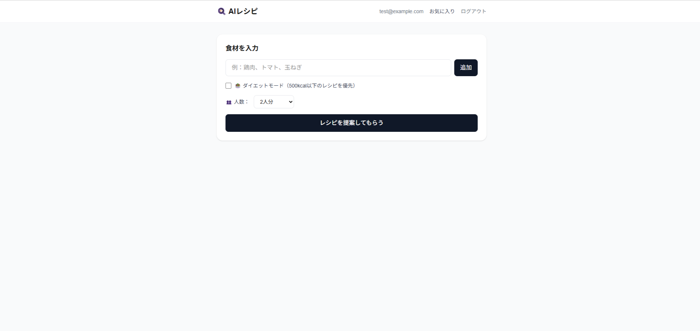
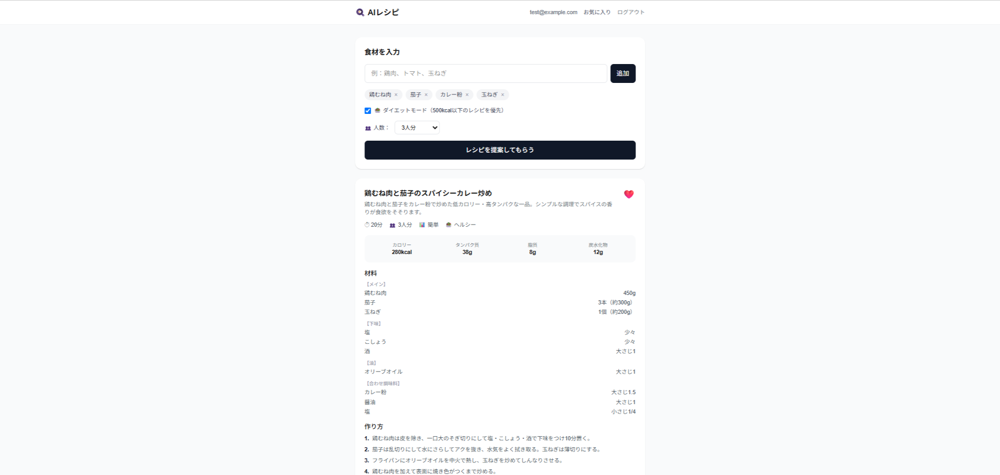
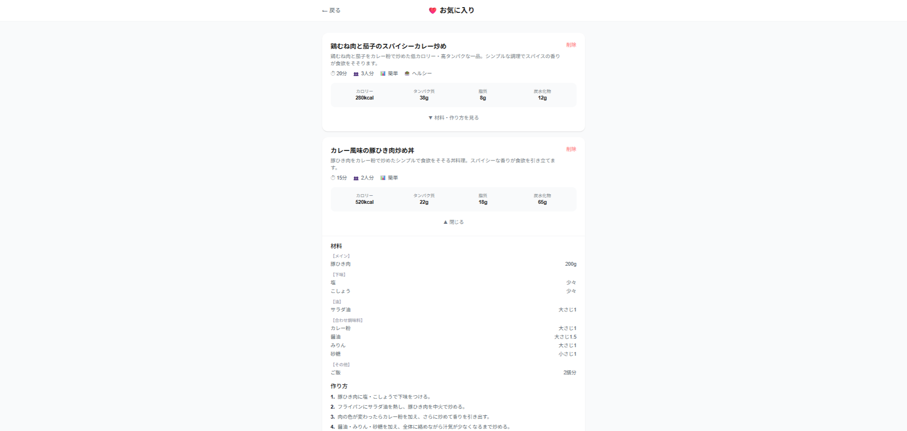

# 🍳 AIレシピアプリ

冷蔵庫の余り食材を入力するだけで、AIが献立を即提案。食材ロス削減・ダイエット管理・料理の時短に使えるWebアプリです。

## 🌐 デモ

https://recipe-app-waj3.vercel.app

### テスト用アカウント
- メールアドレス: `test@example.com`
- パスワード: `test1234`

## 📸 スクリーンショット

**メイン画面（レシピ生成）**


**レシピ提案結果**


**お気に入り一覧**


## ✨ 機能

- 🥘 **AIレシピ提案** - 食材を入力するとClaude AIが3つのレシピを提案
- 👥 **人数選択** - 1〜5人分以上の分量で提案
- 🥗 **ダイエットモード** - 500kcal以下のヘルシーレシピを優先
- 📊 **栄養素表示** - カロリー・タンパク質・脂質・炭水化物を表示
- 🗂️ **材料カテゴリ分け** - メイン・調味料・油・下味に分類
- ❤️ **お気に入り保存** - 気に入ったレシピをDBに保存
- 🔐 **ユーザー認証** - メール・パスワードでのログイン/新規登録

## 🛠️ 技術スタック

| カテゴリ | 技術 |
|---|---|
| フロントエンド | Next.js 16 / TypeScript / Tailwind CSS |
| AI | Claude API (claude-sonnet-4-6) |
| 認証 | NextAuth.js v4 |
| データベース | Neon (PostgreSQL) |
| ORM | Prisma 7 |
| デプロイ | Vercel |

## 📁 ディレクトリ構成
recipe-app/

├── app/

│   ├── api/

│   │   ├── auth/[...nextauth]/  # NextAuth認証

│   │   ├── favorites/           # お気に入りCRUD

│   │   ├── recipe/              # Claude APIレシピ生成

│   │   └── register/            # ユーザー登録

│   ├── favorites/               # お気に入りページ

│   ├── login/                   # ログインページ

│   ├── register/                # 新規登録ページ

│   ├── layout.tsx

│   ├── page.tsx                 # メインページ

│   └── providers.tsx

├── lib/

│   └── prisma.ts                # Prismaクライアント

├── prisma/

│   ├── schema.prisma            # DBスキーマ

│   └── migrations/

└── prisma.config.ts

## 🚀 ローカル開発

### 必要なもの
- Node.js 18以上
- Neon PostgreSQLアカウント
- Anthropic APIキー

### セットアップ

```bash
# リポジトリのクローン
git clone https://github.com/Kazz1987/recipe-app.git
cd recipe-app

# パッケージインストール
npm install

# 環境変数の設定
cp .env.example .env
# .envを編集してください

# DBマイグレーション
npx prisma migrate dev

# 開発サーバー起動
npm run dev
```

### 環境変数
DATABASE_URL=        # NeonのPostgreSQL接続URL

NEXTAUTH_SECRET=     # NextAuth用シークレットキー

NEXTAUTH_URL=        # アプリのURL（開発時はhttp://localhost:3000）

ANTHROPIC_API_KEY=   # Anthropic APIキー

## 📝 今後の予定

- [ ] Googleログイン対応
- [ ] レシピの検索・フィルター機能
- [ ] i18n対応（英語）
- [ ] レシピの評価機能

## 📋 要件定義

### 背景・目的
冷蔵庫にある食材からレシピを考えるのが面倒という課題を解決するため、AIを活用したレシピ提案アプリを開発。

### ターゲットユーザー
- 料理のレパートリーを増やしたい人
- 食材を無駄にしたくない人
- ダイエット中で食事管理をしたい人

### 機能要件
| 機能 | 詳細 |
|---|---|
| 食材入力 | テキスト入力またはタグ形式で複数食材を追加 |
| レシピ提案 | Claude AIが3つのレシピを同時提案 |
| 人数選択 | 1〜5人分以上から選択して分量を調整 |
| ダイエットモード | 500kcal以下のレシピを優先して提案 |
| 栄養素表示 | カロリー・PFC（タンパク質・脂質・炭水化物）を表示 |
| 材料カテゴリ分け | メイン・調味料・油・下味に分類して見やすく表示 |
| お気に入り保存 | ログインユーザーがレシピをDBに保存 |
| ユーザー認証 | メール・パスワードで登録・ログイン |

### 非機能要件
- レスポンシブデザイン（スマホ・PC対応）
- APIキーをサーバーサイドで管理（セキュリティ）
- 他ユーザーのお気に入りを操作できない（所有者チェック）

## 🗄️ DB設計

### ER図

```
users
├── id          INT (PK)
├── email       VARCHAR(255) UNIQUE
├── password    VARCHAR(255)
└── createdAt   DATETIME

favorites
├── id          INT (PK)
├── userId      INT (FK -> users.id)
├── recipeName  VARCHAR(255)
├── recipeData  JSONB
└── createdAt   DATETIME
```

### テーブル設計の理由
- `recipeData`をJSONBで保存することでClaudeのレスポンスをそのまま格納でき、スキーマ変更に柔軟に対応できる
- `ON DELETE CASCADE`でユーザー削除時にお気に入りも自動削除

## 🔌 API設計

| メソッド | エンドポイント | 認証 | 説明 |
|---|---|---|---|
| POST | `/api/register` | 不要 | ユーザー登録 |
| POST | `/api/auth/signin` | 不要 | ログイン（NextAuth） |
| POST | `/api/recipe` | 不要 | レシピ生成 |
| GET | `/api/favorites` | 必要 | お気に入り一覧取得 |
| POST | `/api/favorites` | 必要 | お気に入り追加 |
| DELETE | `/api/favorites` | 必要 | お気に入り削除 |

## 🤔 技術選定理由

| 技術 | 選定理由 |
|---|---|
| **Next.js** | フロントエンド・バックエンドを一体で管理でき、API Routeでキーを安全に管理できる |
| **Claude API** | 高品質なレシピ生成・JSON形式での構造化レスポンスが得やすい |
| **Neon** | サーバーレスPostgreSQLでVercelとの相性が良く、無料枠が充実 |
| **Prisma 7** | 型安全なDB操作・マイグレーション管理が容易 |
| **NextAuth** | 認証の実装工数を削減しつつセキュアな認証を実現 |
| **Vercel** | Next.jsとの親和性が高く、GitHubと連携して自動デプロイが可能 |

## 🔒 セキュリティ対策

- APIキーをサーバーサイド（API Route）のみで使用しクライアントに露出しない
- パスワードをbcryptでハッシュ化して保存
- お気に入りの削除時に所有者チェックを実施
- 内部エラーの詳細をクライアントに返さない
- 入力値のバリデーション（メール形式・パスワード8文字以上・食材20文字以内）

